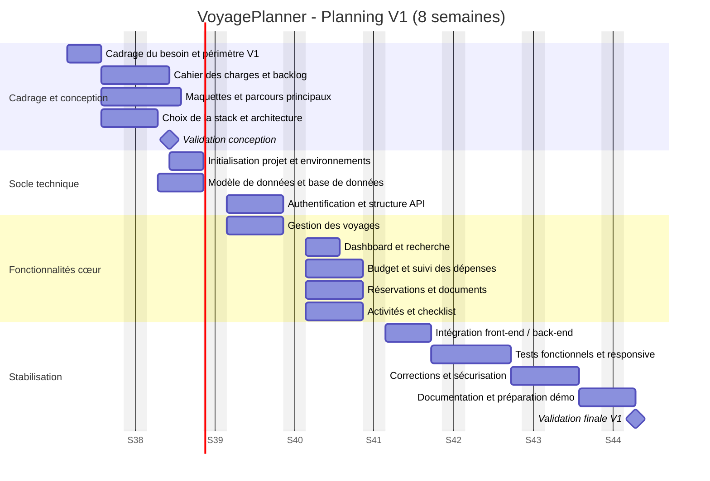

# Gantt prévisionnel - V1 VoyagePlanner

## Hypothèses

- Planning exprimé en semaines, du lundi au vendredi.
- Durées estimées pour un binôme : une personne côté cadrage/validation et une personne côté conception/développement, avec un partage du développement.
- La V1 comprend les fonctionnalités essentielles : authentification simple, gestion des voyages, budget, réservations, documents, activités, checklist et tableau de bord.
- Le journal de voyage, les notifications avancées, le partage multi-utilisateurs et les intégrations externes sont reportés après la V1.

## Vue Gantt

## Détail des tâches et dépendances

| ID | Tâche | Durée | Dépendance | Responsable principal | Livrable |
|---|---|---:|---|---|---|
| A1 | Cadrage du besoin et périmètre V1 | 3 j | - | Moi | Périmètre validé |
| A2 | Cahier des charges et backlog | 4 j | A1 | Moi / Binôme | Backlog priorisé |
| A3 | Maquettes et parcours principaux | 5 j | A1 | Binôme | Wireframes des écrans clés |
| A4 | Choix de la stack et architecture | 3 j | A1 | Binôme | Architecture technique |
| M1 | Validation de la conception | 0 j | A2, A3, A4 | Moi | Go de développement |
| B1 | Initialisation du projet et environnements | 3 j | M1 | Binôme | Projet exécutable |
| B2 | Modèle de données et base de données | 4 j | A4, M1 | Binôme | Schéma et migrations |
| B3 | Authentification et structure API | 5 j | B1, B2 | Binôme | API sécurisée minimale |
| C1 | Gestion des voyages | 5 j | B2, B3 | Moi / Binôme | CRUD voyages fonctionnel |
| C2 | Dashboard et recherche | 3 j | C1 | Moi / Binôme | Vue d’ensemble opérationnelle |
| C3 | Budget et suivi des dépenses | 5 j | C1, B3 | Moi / Binôme | Calculs et suivi du budget |
| C4 | Réservations et documents | 5 j | C1, B3 | Moi / Binôme | Réservations et pièces associées |
| C5 | Activités et checklist | 5 j | C1, B3 | Moi / Binôme | Planification et préparation |
| D1 | Intégration front-end / back-end | 4 j | C2, C3, C4, C5 | Moi / Binôme | Parcours V1 connecté |
| D2 | Tests fonctionnels et responsive | 5 j | D1 | Binôme | Rapport de tests |
| D3 | Corrections et sécurisation | 4 j | D2 | Moi / Binôme | Version stabilisée |
| D4 | Documentation et préparation de la démonstration | 3 j | D3 | Moi | Documentation V1 et support |
| M2 | Validation finale V1 | 0 j | D4 | Moi / Client | V1 validée |

## Synthèse par semaine

| Semaine | Travaux principaux | Résultat attendu |
|---|---|---|
| S1 | Cadrage, périmètre, début du cahier des charges | Besoin clarifié |
| S2 | Backlog, maquettes, architecture, validation M1 | Conception validée |
| S3 | Initialisation, base de données, API et authentification | Socle technique prêt |
| S4 | Gestion des voyages, dashboard | Premier parcours utilisable |
| S5 | Budget, réservations et documents | Gestion opérationnelle du séjour |
| S6 | Activités, checklist, intégration | Fonctionnalités cœur reliées |
| S7 | Tests fonctionnels, responsive et corrections | Version candidate |
| S8 | Stabilisation finale, documentation, démonstration | V1 validée |

## Chemin critique

Le chemin critique prévisionnel est : **A1 -> A2/A3/A4 -> M1 -> B1/B2 -> B3 -> C1 -> C3/C4/C5 -> D1 -> D2 -> D3 -> D4 -> M2**.

Tout retard sur le cadrage, le modèle de données, l'API, la gestion des voyages ou la phase de tests décale directement la validation de la V1. Les tâches C2, C3, C4 et C5 peuvent être réparties entre les membres du binôme après la livraison de C1 et du socle API.